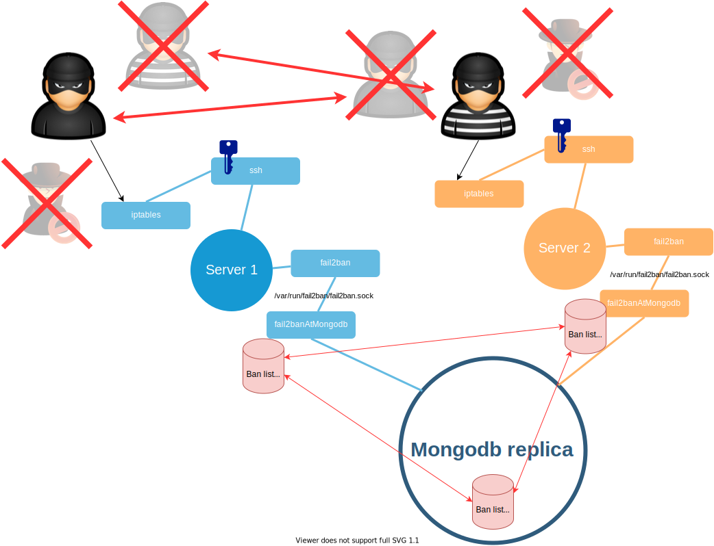
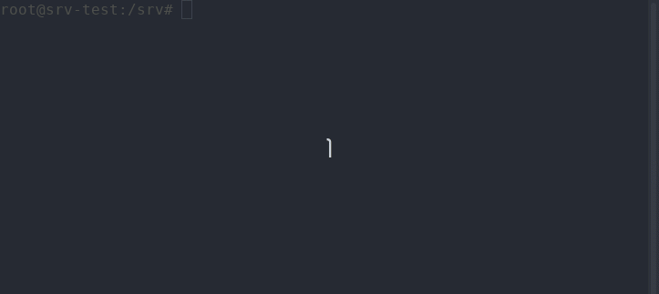

# fail2banAtMongodb

This is nodejs application to synchronize ban list at multiple servers.
Application run as daemon. Application connect to fail2ban via unix socket.


## Install video


## Install

```bash
git clone https://github.com/drudrum/fail2banAtMongodb.git
cd fail2banAtMongodb
npm install
```

Create [settings.js](help/settings.example.js)
```javascript
module.exports={
  dbSettings:{
      user:'fail2ban',
      pwd:"xxxxx",
      db:'fail2ban',
      replica:{
        name:"ansReplica",
        members:["localhost:37017","localhost:37018"]
      }
  },
  fail2banSocket:'/var/run/fail2ban/fail2ban.sock',
  jailNames:['nginx-botsearch','sshd'],
  banTime:(60*60*12), //12h
  loop:15000,
  ourJailName:'ansServices'
};
```

Create collections and indexes (expire time)
```bash
npm run firstrun
```

Run service at console (Root access for /var/run/fail2ban/fail2ban.sock)
```bash
sudo npm start
```

## Install to system
```
sudo help/install.sh
```

[Script](help/install.sh) creates [configs](help/configExamples.md)
- [/etc/systemd/system/fail2banAtMongodb.service](help/fail2banAtMongodb.service)
- [/etc/fail2ban/jail.d/custom.local](help/custom.local)


Then start service, check it, enable on boot.
```
sudo systemctl start fail2banAtMongodb
sudo systemctl status fail2banAtMongodb
sudo systemctl enable fail2banAtMongodb
```


## Show jail status
Root access for /var/run/fail2ban/fail2ban.sock
```bash
sudo npm run status
```
Status like this:
```bash
sshd
{
  filter: {
    currentlyFailed: 16,
    totalFailed: 1624,
    fileList: [ '_SYSTEMD_UNIT=sshd.service + _COMM=sshd' ]
  },
  actions: {
    currentlyBanned: 32,
    totalBanned: 334,
    bannedIPList: [
      '37.187.113.229',  '45.148.10.65',
      '51.77.147.5',     '54.38.240.23',
      '79.136.70.159',   '85.209.0.7',
      '119.28.51.97',    '61.189.243.28',
      '49.234.210.179',  '49.235.252.236',
      '185.235.40.133',  '139.59.66.101'
    ]
  }
}
ansServices
{
  filter: {
    currentlyFailed: 16,
    totalFailed: 1564,
    fileList: [ '/dev/null' ]
  },
  actions: { currentlyBanned: 0, totalBanned: 256, bannedIPList: [] }
}
```

## Manual ban / unban
Ban ip at all servers.
```sh
npm run ban 12.12.12.12
```
Unban at all servers.
```sh
npm run unban 12.12.12.12
```

## Ban and unban via mongoDb
just insert doc into 'ban'/'unban' collection.
All servers will transfer ban to a jail.

Examples:
```javascript
await mdb.collection('ban').insertOne({
  ip:'123.123.12.12',
  t:new Date(),
  msg:'tst'
});

await mdb.collection('unban').insertOne({
  ip:'12.12.12.12',
  t:new Date(),
  reason:'Test manual'
});
```

You can [create special role](help/createRole.md) at mongoDb, to access this collections from another services.
