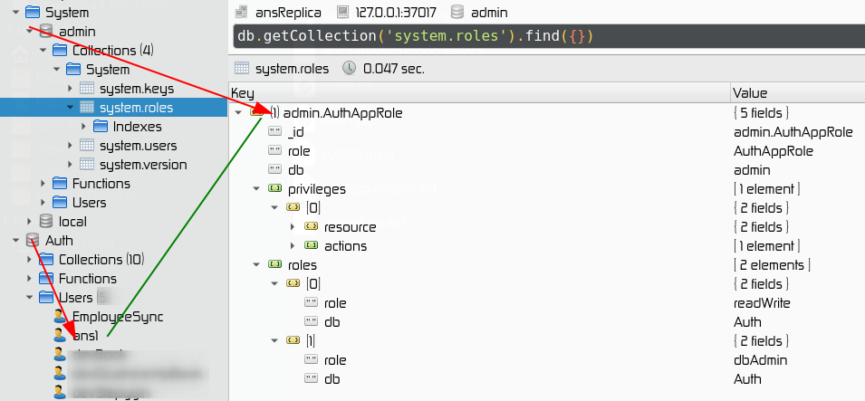

## Create role at mongoDb
Example of 'AuthAppRole' user role
```javascript
use admin
db.createRole({
  role: "AuthAppRole",
  privileges: [
    {
      resource: { db: "fail2ban", collection: "ban" },
      actions: [ "insert" ]
    }
  ],
  roles: [
    { role: "readWrite", db: "Auth" },
    { role: "dbAdmin", db: "Auth" }
  ]
})
```

role stored in admin database

## Change role of existing user
user stored in Auth database
```javascript
use Auth
db.updateUser("ans1",{
    roles:[{role:'AuthAppRole',db:'admin'}]
})
```


